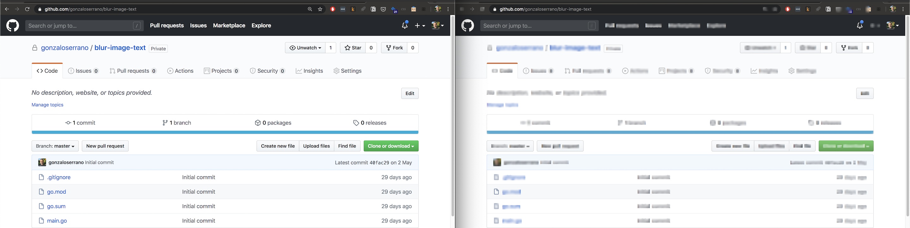

## Blur the text of an image

### How to

- [install go](https://golang.org/doc/install) and add `$GOBIN` to your `$PATH`
- install the program: `go install github.com/gonzaloserrano/blur-image-text`
- run `blur-image-text <png-image-path> <blur-level> <text-confidence-level>`
- example:
    - `blur-image-text github.png 7 20`
    - generates `github_blurred.png`

Experiment with different blur levels and text confidence levels depending on the input.

### TODO

- make it work with other image formats than png
- looks like text blurring can be reversed, so provide other alternatives
